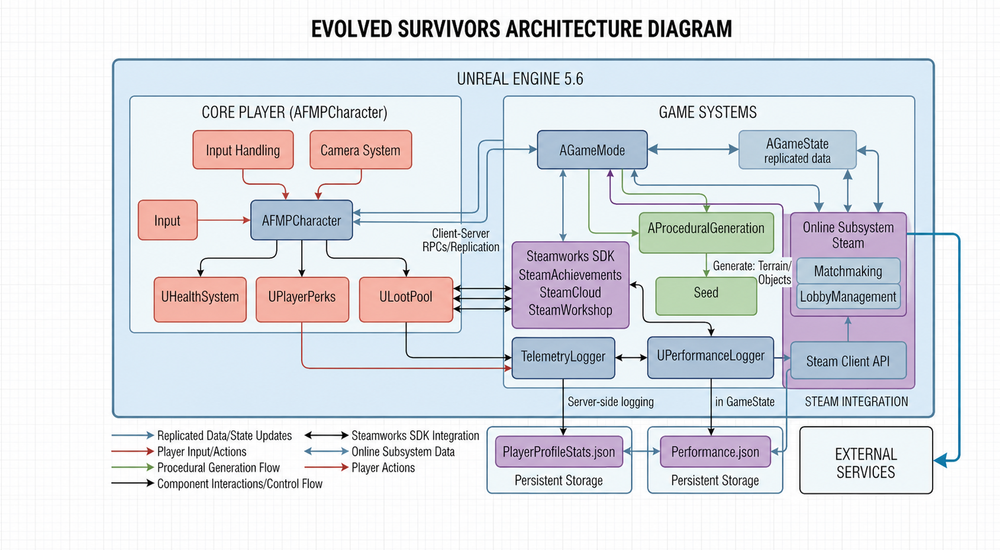

# Evolved Survivors

In this high-stakes, up to 4-player cooperative 3D roguelike, you and your squad are thrust into an ever-shifting environment where no two lobbies are ever the same. Built on a foundation of procedural world generation, the game challenges players to navigate complex, unpredictable landscapes that are rendered with technical precision to ensure a seamless multiplayer experience. Survival isn't just about fast reflexes; it’s about mastering a deep, deck-based perk system that allows for limitless build variety.To ensure a constant sense of progression and evolving strategy, every time a player completes a round, a new, unique perk enters the loot pool, expanding the potential combinations available for the next draw. As you progress, you’ll draw from this randomized pool to equip game-changing abilities—ranging from massive stat boosts to unique mechanical synergies—effectively building your character's deck in real-time. Whether you’re coordinating roles with your teammates or braving the escalating difficulty alone, the game’s authoritative server-client architecture ensures that every shot and perk activation is perfectly synchronized, delivering a polished and intense cooperative journey through a world that literally rebuilds itself every time you play.

## Research & Planning

### Research

#### Networking and Multiplayer in Unreal Engine 5

"Networking and Multiplayer" is an official documentation section published by Epic Games, the developers of Unreal Engine 5 (Networking and Multiplayer in Unreal Engine | Unreal Engine 5.7 Documentation | Epic Developer Community, s.d.). Epic Games is a global leader in the games industry, and their networking framework is widely considered the gold standard for synchronized, client-server gameplay. This documentation reflects Epic’s commitment to providing a professional-grade architecture for developers to build scalable multiplayer experiences. While highly regarded for its technical depth and reliability, some community members have noted that the learning curve for "Network Relevancy" and "RPCs" can be steep, often requiring significant trial and error to master. Nevertheless, it remains the definitive authority for Unreal developers.

The source explains the core Client-Server model, where the server acts as the ultimate authority to prevent cheating. It covers essential concepts such as Actor Replication, Property Replication (using ReplicatedUsing for RepNotifies), and Remote Procedure Calls (RPCs). The guide details how data is passed between the server and clients, ensuring that game states like health and positioning are synchronized across the network (Networking and Multiplayer in Unreal Engine | Unreal Engine 5.7 Documentation | Epic Developer Community, s.d.).

I found this documentation incredibly insightful because it lays out the "why" behind server authority. The step-by-step breakdown of how a variable travels from the server to the client was particularly helpful for understanding bandwidth optimization. However, the language is quite dense; as a student, I felt that more visual flowcharts of the packet lifecycle would have helped bridge the gap for beginners. I disagreed with the brief coverage of "Listen Servers," as more practical examples of host-player logic would have been beneficial.

#### Procedural Mesh Component in Unreal Engine 5

"Procedural Mesh Component" is an official technical guide provided by Epic Games (Procedural Mesh | Unreal Engine 5.7 Documentation | Epic Developer Community, s.d.). As the creators of the engine, Epic provides these resources to empower developers to create dynamic, runtime-generated geometry. The documentation is praised for its high degree of control, allowing developers to manipulate individual vertices and indices. However, critics often point out that the documentation assumes a high level of mathematical proficiency, particularly in linear algebra and coordinate spaces, which can be a barrier for some.

This source explains how to generate 3D geometry at runtime by defining arrays of Vertices, Triangles, Normals, and UVs. It demonstrates how to use the CreateMeshSection function to build physical objects from purely mathematical data. This is essential for creating infinite, non-repetitive landscapes or destructible environments that are not limited by pre-made static meshes (Procedural Mesh | Unreal Engine 5.7 Documentation | Epic Developer Community, s.d.).

I appreciated this source for its "no-nonsense" approach to geometry. Learning how triangles are wound (clockwise vs. counter-clockwise) to determine face direction was a fascinating technical hurdle. While the documentation is mathematically robust, I felt it lacked sufficient information on optimizing procedural meshes for collisions. I found the lack of a "Best Practices" section for performance frustrating, as generating large meshes at runtime can easily stall the game thread if not handled carefully.

#### Roguelike Mechanics: Case Study of Risk of Rain 2

Risk of Rain 2, developed by Hopoo Games (Hopoo Games, 2020), serves as a primary research case study for modern 3D Roguelike design. Hopoo Games is an independent studio that successfully transitioned a 2D franchise into a critically acclaimed 3D hit. They are recognized for their mastery of "Game Loops" and "Power Scaling." While the game is praised for its addictive loop, some players find the exponential difficulty scaling to be punishingly steep, suggesting a polarizing approach to balance.

The game demonstrates the core tenets of the Roguelike genre: Permadeath, Procedural Generation, and Meta-Progression. Specifically, it uses a "Director" system that scales difficulty based on time and player count. The "Stacking Item System" is a key research point, showing how individual buffs can combine to create unique "builds" in every run, ensuring high replayability (Hopoo Games, 2020).

Researching Risk of Rain 2 was the most engaging part of my planning. I found the "Director" concept—where an invisible AI spends a "budget" to spawn enemies—to be a brilliant way to manage difficulty. I particularly enjoyed analyzing how the game maintains its challenge in multiplayer. However, I felt that the game’s reliance on RNG (Random Number Generation) can sometimes lead to "dead runs," which I aim to mitigate in my own design by ensuring a baseline level of player agency through the perk selection system.

### Planning

1. Environment Foundation: I began with Procedural Generation. This was the most complex technical task, so it was vital to ensure the world could generate and handle collisions before any other systems were built.

2. Survival Core: Next, I implemented the Health Component. This established the "win/loss" condition for the player and provided the necessary delegates for the UI to function.

3. Threat Implementation: With a world to move in and a way to die, I added Enemy AI. I planned the spawner logic to interact directly with the navmesh generated by the procedural world.

4. Progression Systems: I then worked on Player Perks and the Loot Pool. This was the "Roguelike" heart of the game, requiring a bridge between C++ data structures and Blueprint effects.

5. Game Loop: Once the pieces were in place, I developed the Game Loop (rounds, ready-up systems, and win/loss states) to tie the mechanics into a cohesive experience.

6. Polishing: Finally, I added Assets to replace placeholder meshes, followed by a dedicated phase for Testing and Optimization, where I utilized the Performance Logger to ensure a stable frame rate.

## Design & Technical Development

### The HealthSystem Component: Decoupled Logic and Authority

The `UHealthSystem` was engineered as a standalone `UActorComponent` to maximize reusability across different actor types. By inheriting from `UActorComponent`, the system gains a lightweight footprint, avoiding the overhead of the full Transform hierarchy associated with Scene Components. The primary design pattern utilized here is the Observer Pattern, implemented via dynamic multicast delegates. This allows the UI and SFX systems to remain entirely ignorant of the health logic, simply reacting when the OnHealthChanged event is broadcast.

A critical technical challenge addressed in this class is the Listen-Server feedback loop. In Unreal Engine, `OnRep` functions trigger on clients upon variable replication but do not naturally trigger on the server that changed them. For a host player, this results in a UI that does not update until the server manually executes the same logic. I resolved this by manually calling the `OnRep` function within the server-authoritative DecreaseHealth and IncreaseHealth functions.

```
void UHealthSystem::DecreaseHealth(float HealthDelta, const class UDamageType* DamageType)
{
    if (!GetOwner()->HasAuthority()) return;

    float OldHealth = CurrentHealth;
    CurrentHealth = FMath::Clamp(CurrentHealth - HealthDelta, 0.0f, MaxHealth);
    
    // Manual trigger for Server-side UI parity
    OnRep_Health(OldHealth); 
}
```

The use of `FMath::Clam` ensures data integrity, preventing the CurrentHealth from ever entering a negative state, which could cause errors in UI progress bars or logic gates that check for death. This component-based approach allows the same health logic to be applied to AI enemies, where the delegate is bound to the AI Controller’s blackboard rather than a player’s HUD.

### Procedural Generation: Algorithmic Efficiency and HISMs

The `AProceduralGeneration` class serves as the project's environmental architect, tasked with creating a performant, networked, and aesthetically varied landscape. The primary technical challenge was managing the computational cost of "Poisson Disc-like" distribution for thousands of environmental assets while maintaining a strict frame budget.

#### Spatial Partitioning and Collision Optimization

To solve the $O(N^2)$ complexity inherent in traditional object placement—where every new object must check for collisions against every existing one—I implemented a Grid-Based Spatial Partitioning system. By utilizing a `TMap<FIntPoint, TArray<FSpawnedObjectInfo>>`, the world is discretized into a 2D grid. When attempting to place a new asset, the algorithm only queries the current cell and its eight immediate neighbors. This reduces the search space from thousands of entries to a localized handful, effectively maintaining $O(1)$ placement time regardless of total map size.

```
bool AProceduralGeneration::IsLocationClear(const FVector& Location, float CheckRadius)
{
    FIntPoint CenterCell = GetGridCoordinates(Location);

    // Check only the 3x3 neighborhood around the target location
    for (int32 x = -1; x <= 1; ++x)
    {
        for (int32 y = -1; y <= 1; ++y)
        {
            FIntPoint TargetCell(CenterCell.X + x, CenterCell.Y + y);
            
            if (TArray<FSpawnedObjectInfo>* CellObjects = SpawnedObjectGrid.Find(TargetCell))
            {
                for (const FSpawnedObjectInfo& Info : *CellObjects)
                {
                    // Basic distance-based collision check
                    float DistanceSq = FVector::DistSquared(Location, Info.Location);
                    float CombinedRadius = CheckRadius + Info.Radius;
                    if (DistanceSq < (CombinedRadius * CombinedRadius))
                    {
                        return false; // Collision detected
                    }
                }
            }
        }
    }
    return true; // Safe to spawn
}
```

#### Rendering Optimization via HISM

Standard AActor spawning carries significant overhead, including component initialization and individual draw calls. To achieve high density, I utilized Hierarchical Instanced Static Meshes (HISM). HISMs enable the GPU to draw all instances of a specific mesh (e.g., a pine tree) in a single draw call via hardware instancing. The "Hierarchical" nature is critical for performance; it builds a cluster-based tree structure that allows Unreal Engine to perform efficient frustum culling and per-instance LOD (Level of Detail) transitions. This ensures that while there may be 5,000 rocks in the world, the GPU only processes high-fidelity geometry for those immediately in the player's view.

```
void AProceduralGeneration::PopulateObjects()
{
    // ... after calculating FinalSpawnLocation and InstanceRotation ...
    
    if (UHierarchicalInstancedStaticMeshComponent** HISMCompPtr = MeshToHISMMap.Find(MeshSetting.Mesh))
    {
        UHierarchicalInstancedStaticMeshComponent* HISMComp = *HISMCompPtr;
        
        // AddInstanceWorldSpace is faster than spawning an Actor and handles the GPU buffer update
        HISMComp->AddInstanceWorldSpace(FTransform(InstanceBaseRotation, FinalSpawnLocation, FVector(Scale)));
        
        // Update the spatial grid to prevent future overlaps in this location
        AddObjectToGrid(FinalSpawnLocation, MeshSetting.Radius);
    }
}
```

#### Deterministic Networking Strategy

Synchronizing a procedurally generated world in multiplayer usually requires massive bandwidth to send mesh data to clients. I bypassed this by implementing a Deterministic Seed System. By marking a single int32 Seed variable for replication, I ensure the server and all clients possess the same starting value for their Random Number Generators (RNG).

```
UPROPERTY(ReplicatedUsing = OnRep_Seed)
int32 Seed;
```
```
void AProceduralGeneration::OnRep_Seed()
{
    // Clients receive the seed and run the exact same generation loop as the server
    GenerateWorld();
}

void AProceduralGeneration::GenerateWorld()
{
    // Seed the stream so FMath::FRand() produces the same sequence on all machines
    FMath::SRand(Seed);
    
    CreateVertices();
    CreateTriangles();
    PopulateObjects(); // Local HISM generation based on deterministic RNG
    
    // Notify the navigation system to rebuild now that the floor exists
    UNavigationSystemV1::UpdateComponentInNavOctree(*ProceduralMesh);
}
```

This approach achieves 100% visual parity across the network. Because the generation algorithm is mathematical and deterministic, the server only needs to send 4 bytes (the integer seed) rather than megabytes of vertex and transform data. This allows the game to support large-scale procedural worlds even on low-bandwidth connections, as the heavy lifting of construction happens locally on each client's CPU.

### The Game Framework: Authority vs. Synchronization

In Unreal Engine’s multiplayer architecture, the relationship between the `GameMode` and `GameState` represents the fundamental divide between Server Authority and Client Representation. By strictly segregating logic into these two classes, I ensured that the "rules" of the Roguelike remain unhackable on the server while the "status" of the game is perfectly mirrored across all player screens.

#### `ATheGameMode`: The Authoritative Decision Maker

The `ATheGameMode` class is the "Brain" of the project. Critically, this actor exists only on the server. Because it is never replicated to clients, its internal variables and logic are invisible to players, providing a secure environment for sensitive gameplay calculations.

I utilized the `GameMode` to manage the lifecycle of a "Run." This includes handling player logins, spawning the procedural world, and—most importantly—calculating the difficulty scaling. By keeping the `BaseRoundDuration` and `CurrentRoundSpawnRate` within this class, I prevent "Memory Hacking" where a client might attempt to artificially lengthen a timer or reduce enemy counts.

```
void ATheGameMode::PostLogin(APlayerController* NewPlayer)
{
    Super::PostLogin(NewPlayer);

    if (ATheGameState* GS = GetGameState<ATheGameState>())
    {
        // Update the global player count in the state
        GS->TotalPlayersInGame++;
        
        // Recalculate difficulty immediately to account for the new player
        RefreshDifficultyScaling();
    }
}

void ATheGameMode::Logout(AController* Exiting)
{
    Super::Logout(Exiting);

    if (ATheGameState* GS = GetGameState<ATheGameState>())
    {
        GS->TotalPlayersInGame = FMath::Max(0, GS->TotalPlayersInGame - 1);
        RefreshDifficultyScaling();
    }
}
```

This implementation demonstrates a reactive difficulty system. By overriding PostLogin and Logout, the `GameMode` ensures that the challenge level is always mathematically proportional to the current team size, fulfilling the Roguelike requirement for a fair but escalating challenge.

#### `ATheGameState`: The Synchronized Global Blackboard
While the `GameMode` makes the decisions, the ATheGameState is responsible for broadcasting those decisions. It acts as a "Global Blackboard" that every client can read. All critical gameplay variables here are marked with the `Replicated` or `ReplicatedUsing` specifiers.

A key feature of my `GameState` is the use of `RepNotify` (`ReplicatedUsing`) for the `ReadyPlayersCount` and `bIsRoundActiv` variables. This ensures that when the server updates these values, a specific function (OnRep_...) is triggered on every client, allowing the UI to update instantly without polling the server every frame.

```
UPROPERTY(ReplicatedUsing = OnRep_IsRoundActive, BlueprintReadOnly, Category = "Round")
bool bIsRoundActive = false;

UPROPERTY(Replicated, BlueprintReadOnly, Category = "Round")
float RoundTimer = 0.0f;

```
```
void ATheGameState::GetLifetimeReplicatedProps(TArray<FLifetimeProperty>& OutLifetimeProps) const
{
    Super::GetLifetimeReplicatedProps(OutLifetimeProps);

    // Registering these ensures the Server's values are pushed to all Clients
    DOREPLIFETIME(ATheGameState, bIsRoundActive);
    DOREPLIFETIME(ATheGameState, RoundTimer);
    DOREPLIFETIME(ATheGameState, CurrentRoundNumber);
    DOREPLIFETIME(ATheGameState, TotalPlayersInGame);
}
```
The `RoundTimer` replication is essential for synchronization. Since the server increments this value and replicates it, all players see the exact same countdown. This prevents a scenario where one player’s round ends before another’s due to local CPU clock drift.

#### The Interaction: Logic Pushing to State

The interaction between these two classes follows a "Command and Broadcast" pattern. The `GameMode` commands a change in state, and the `GameState` broadcasts that change to the world.

For example, when a round ends, the `GameMode` performs the cleanup (deleting enemies and logging telemetry) and then updates the `GameState` to inform clients that they should display the "Intermission" UI.

```
void ATheGameMode::EndRound()
{
    ATheGameState* GS = GetGameState<ATheGameState>();
    if (!GS) return;

    // 1. Authoritative Cleanup: Server-only logic
    for (AEnemySpawner* Spawner : CachedSpawners)
    {
        Spawner->EndSpawningAndClearEnemies();
    }

    // 2. State Update: Pushing data to the replicated GameState
    GS->bIsRoundActive = false;
    GS->CurrentRoundNumber++;
    
    // 3. Trigger Scaling: Update values for the next round
    RefreshDifficultyScaling();

    // 4. Persistence: Record data via TelemetryLogger (Server-side only)
    TelemetryLogger::RecordSessionData(GS->CurrentRoundNumber, GS->AllUnlockedPerks);
}
```

In the `RefreshDifficultyScaling` function, the `GameMode` reads the current player count from the `GameState`, performs the math, and then pushes new settings back to the AEnemySpawner actors.

```
void ATheGameMode::RefreshDifficultyScaling()
{
    ATheGameState* GS = GetGameState<ATheGameState>();
    if (!GS) return;

    // SCALING FORMULA: Increases difficulty per round and per player
    float PlayerScalingFactor = 1.0f + (GS->TotalPlayersInGame - 1) * 0.5f;
    
    // CurrentRoundSpawnRate is a non-replicated member of GameMode
    CurrentRoundSpawnRate = BaseSpawnRate / (GS->CurrentRoundNumber * PlayerScalingFactor);
    CurrentRoundMaxEnemies = FMath::RoundToInt(BaseMaxEnemies * GS->CurrentRoundNumber * PlayerScalingFactor);

    // Command the world: Update spawner settings
    for (AEnemySpawner* Spawner : CachedSpawners)
    {
        Spawner->ConfigureSpawner(CurrentRoundSpawnRate, CurrentRoundMaxEnemies);
    }
}
```

This interaction ensures that the "Heavy Lifting" (AI management, spawning, and math) is hidden within the `GameMode`, while the `GameState` provides a clean, synchronized API for the clients to drive their HUDs and local visual effects. This architecture is the backbone of the project’s multiplayer stability, ensuring that even under high network load, the core rules of the game remain consistent for every participant.

### Perks and the Loot Pool: Data-Driven Extensibility

The progression system of a Roguelike depends entirely on the variety and synergy of "builds." To achieve this, I engineered a tripartite architecture consisting of the `PlayerPerks` component (data storage), the `LootPool` component (selection logic), and the `PerkEffectBase` (behavioral execution). This structure follows a Bridge Pattern, separating the abstract concept of a "Perk" from its specific implementation in the game world.

#### UPlayerPerks: The Replicated Inventory

The `UPlayerPerks` component acts as the persistent inventory for each player. It is responsible for tracking which perks are currently active and ensuring those choices are synchronized across the network. A core technical feature is the `FPerks` struct, which uses `TSubclassOf<UPerkEffectBase>` to allow C++ logic to spawn and manage Blueprint-defined effects safely.To maintain multiplayer integrity, I implemented a strict Server-Request-Validation flow. A client cannot simply "give" themselves a perk; they must send a `ServerEquipPerk` RPC, which triggers the authoritative logic on the server to verify the request before applying any stat changes.

```
UPROPERTY(Replicated, BlueprintReadOnly, Category = "Perks")
TArray<FPerks> EquippedPerks;
```
```
void UPlayerPerks::ServerEquipPerk_Implementation(const FString& PerkName)
{
    // Find the perk in the unlocked list to prevent clients from requesting unearned items
    FPerks* FoundPerk = UnlockedPerks.FindByPredicate([&PerkName](const FPerks& P) {
        return P.Name.Equals(PerkName, ESearchCase::IgnoreCase);
    });

    if (FoundPerk)
    {
        EquippedPerks.Add(*FoundPerk);
        
        // Construct the UObject instance to handle the specific Perk Behavior
        if (FoundPerk->PerkEffectClass)
        {
            UPerkEffectBase* NewEffect = NewObject<UPerkEffectBase>(GetOwner(), FoundPerk->PerkEffectClass);
            ActivePerkInstances.Add(NewEffect);
            NewEffect->ApplyPerkEffect(GetOwner());
        }
    }
}
```

The use of `ActivePerkInstances` ensures that even if a perk has complex logic (like a timer or a tick function), the C++ component retains a pointer to the object, preventing it from being Garbage Collected.

#### ULootPool: The Randomized Selection Logic

While `PlayerPerks` stores data, `ULootPool` manages the "Deck Shuffling" algorithm. The primary design goal was to ensure players are never offered redundant choices. I utilized a Lambda Predicate within the ContainsByPredicate function to filter the available pool. This provides an efficient $O(N)$ search through the player's current equipment to ensure only "Fresh" options are presented during a level-up event.

```
void ULootPool::ResetPool()
{
    if (!GetOwner()->HasAuthority() || !PlayerPerksComponent) return;

    CurrentPerkPool.Empty();

    // Filter logic: Only add perks that are UNLOCKED but NOT yet EQUIPPED
    for (const FPerks& UnlockedPerk : PlayerPerksComponent->UnlockedPerks)
    {
        bool bIsEquipped = PlayerPerksComponent->EquippedPerks.ContainsByPredicate([&UnlockedPerk](const FPerks& EP) {
            return EP.Name.Equals(UnlockedPerk.Name, ESearchCase::IgnoreCase);
        });

        if (!bIsEquipped)
        {
            CurrentPerkPool.Add(UnlockedPerk);
        }
    }
    
    // Shuffle the deck for true randomness
    for (int32 i = CurrentPerkPool.Num() - 1; i > 0; --i)
    {
        int32 j = FMath::RandRange(0, i);
        CurrentPerkPool.Swap(i, j);
    }
}
```

This "Deck Shuffling" approach ensures that as a player progresses and equips more perks, the pool of available options naturally thins out, forcing players into more specialized "Builds"—a hallmark of high-quality Roguelike design.

#### UPerkEffectBase: Decoupled Behavior

To avoid a massive, unmanageable switch-statement containing every perk's logic, I created the `UPerkEffectBase` class. This is an `Abstract` class that defines a contract for what a perk should do. By using `BlueprintImplementableEvent`, I decoupled the technical "Management" (C++) from the creative "Effect" (Blueprints).This allows for rapid iteration: a designer can create a new "Fire Trail" perk in the editor, inheriting from this C++ class, and the `PlayerPerks` system will handle its networking and memory management automatically without a single line of new code being written.

```
UCLASS(Abstract, Blueprintable)
class UPerkEffectBase : public UObject
{
    GENERATED_BODY()

public:
    // Blueprint logic handles the specific visual/mechanical change
    UFUNCTION(BlueprintImplementableEvent, Category = "Perk Logic")
    void ApplyPerkEffect(AActor* TargetActor);

    UFUNCTION(BlueprintImplementableEvent, Category = "Perk Logic")
    void UnapplyPerkEffect(AActor* TargetActor);
};
```

#### The Interaction: The Synergy Loop

The interaction between these classes creates a robust "Selection Loop." When the GameMode signals a round end, it triggers the `ULootPool` on each player's controller.
1. Selection: The `ULootPool` calculates a subset of available perks (excluding those already in `EquippedPerks`).

2. Request: The player clicks a perk in the UI, sending an RPC to `PlayerPerks::ServerEquipPerk`.
3. Instantiation: The `PlayerPerks` component on the server instantiates the `PerkEffect` class defined in the struct.
4. Execution: The newly created `UPerkEffectBase` instance runs its `ApplyPerkEffect` logic (e.g., modifying health, speed, or spawning projectiles).

This loop is highly efficient because the LootPool only exists to do the "math" of the draw, while the `PlayerPerks` remains a lightweight data container. This separation of concerns ensures that even in a chaotic 4-player multiplayer match, the game can handle hundreds of active perk instances across the team without causing server-side performance degradation or network desynchronization.

### Networking Strategy: RPCs and Validation

The multiplayer architecture of this project is built upon the principle of `Server Authority`. In a networked environment, the client is essentially a "dumb terminal" that sends input requests to the server, which then simulates the results and broadcasts them back. To manage this communication, I utilized Remote Procedure Calls (RPCs)—specifically `Server` and `Client` functions—to bridge the gap between local player actions and global game state changes.

#### The Request-Validation Flow

Every critical gameplay action, such as unlocking or equipping a perk, follows a strict validation handshake. When a player interacts with the UI, the client triggers a `Server RPC`. The server then executes a validation check (e.g., verifying if the player has reached the required round or if the perk is actually available) before modifying any variables. This prevents "Client-Side Injection" where a malicious user might attempt to trigger functions they haven't earned.

```
void UPlayerPerks::ServerEquipPerk_Implementation(const FString& PerkName)
{
    // The server-side logic 'PerkEquipLogic' returns false if validation fails
    if (PerkEquipLogic(PerkName))
    {
        // Successful validation leads to state changes and logging
        UE_LOG(LogTemp, Warning, TEXT("SERVER: Perk '%s' validated and equipped."), *PerkName);
        
        // Notify the client that the selection is finalized
        FinishedPerkSelection(); 
    }
    else
    {
        UE_LOG(LogTemp, Error, TEXT("SERVER: Validation FAILED for perk '%s'."), *PerkName);
    }
}
```

#### Reliability and Bandwidth Optimization

A key technical decision in the networking layer was the strategic use of `Reliable` vs `Unreliable` `RPCs`. I designated game-critical state changes—such as starting a round, finalizing perk selections, or player death—as Reliable. This ensures that even if a packet is lost due to network jitter, the engine will retry the transmission until the message is confirmed, preventing the game state from breaking.

Conversely, for high-frequency or cosmetic updates where a missed packet is negligible (like minor UI updates or secondary effects), I utilized the default replication to save bandwidth.

```
UFUNCTION(Server, Reliable)
void ServerFinishedPerkSelection();

// ServerEquipPerk is also Reliable because missing a perk equip would break the build
UFUNCTION(Server, Reliable)
void ServerEquipPerk(const FString& PerkName);
```

#### Client-Side Responsiveness (Predictive Feedback)

To avoid the "input lag" typically associated with waiting for a server response, I implemented `RepNotify` functions. When the server validates a perk and updates the `LastEquippedPerk` variable, the `OnRep_LastEquippedPerk` function triggers on the client. This allows the local UI to react immediately to the server's confirmation, providing a seamless experience for the player even when the round-trip time (ping) is high.

```
void UPlayerPerks::OnRep_LastEquippedPerk()
{
    // This triggers on the client the moment the server replicates the new perk data
    if (!LastEquippedPerk.Name.IsEmpty())
    {
        // Update local HUD or play a 'Perk Gained' sound effect locally
        UpdatePerkHUD(LastEquippedPerk);
    }
}
```

By combining authoritative server validation with efficient replication types and local notifications, the networking strategy ensures a cheat-resistant environment that remains performant across varying network conditions.

### Analytics and Optimization: Performance and Telemetry

To ensure the project met professional standards, I developed two specialized logging classes: `UPerformanceLogger` and `TelemetryLogger`. The `PerformanceLogger` is an `UActorComponent` attached to the `GameState` that captures frame-time, FPS, and memory usage metrics at a regular frequency using `FTimerHandle`.

These metrics are serialized into a `JSON` format using Unreal’s `TJsonWriter`. This allows for a detailed analysis of the procedural generation’s impact on hardware. For example, if a certain density of HISMs causes a spike in frame-time, the log captures the exact Timestamp and MemoryUsedMB, allowing for targeted optimization.

```
void UPerformanceLogger::WriteLogToFile()
{
    FString OutputString;
    TSharedRef<TJsonWriter<>> Writer = TJsonWriterFactory<>::Create(&OutputString);
    if (FJsonSerializer::Serialize(RootObject.ToSharedRef(), Writer))
    {
        FFileHelper::SaveStringToFile(OutputString, *GetLogFilePath());
    }
}
```
The `TelemetryLogger` serves a different purpose: tracking the meta-progression of the Roguelike loop. It records which perks were unlocked and the highest round reached. This data is persistent, saved to the `ProjectSavedDir`, ensuring that player progress is retained across sessions. The technical achievement here is the robust handling of the `IPlatformFile` interface, which ensures the directory structure is created correctly across different operating systems, making the project's data management cross-platform ready.

### AI and Spawner Management
The `AEnemySpawner` class manages the lifecycle of AI agents within the procedural environment. A major technical hurdle was ensuring enemies didn't spawn inside the geometry created by the `AProceduralGeneration` class. I solved this by implementing a Line Trace system that fires downwards from a randomized height. If the trace hits the `ProceduralMesh`, the system then utilizes the `UNavigationSystemV1` to find the nearest valid point on the `NavMesh`.

```
if (NavSys->GetRandomReachablePointInRadius(Hit.ImpactPoint, SpawnRadius, NavLocation))
{
    FVector FinalSpawnPos = NavLocation.Location + FVector(0, 0, 70.0f);
    GetWorld()->SpawnActor<ACharacter>(EnemyToSpawnClass, FinalSpawnPos, FRotator::ZeroRotator, SpawnParams);
}
```

By spawning the enemies 70 units above the ground, I ensured they "settle" onto the floor correctly, preventing them from falling through the world due to collision overlap. The spawner also maintains a `TArray<AActor*> SpawnedEnemies` to monitor the population. This allows the `GameMode` to enforce a hard cap on concurrent enemies, preventing the server from being overwhelmed by AI calculations and ensuring that the tick-rate remains high enough for a smooth multiplayer experience.

### Full Documentation & Architecture Diagram

[Documentation](https://siddplus.github.io/FMPGame/)



# Iteration & Problem-solving

Developing a multiplayer roguelike in C++ is a process defined by a constant cycle of failure, diagnosis, and re-engineering. Throughout the development of this project, I encountered several critical roadblocks—some architectural, some design-oriented, and others purely technical. Each of these problems required a significant shift in how I approached the codebase, moving from simple functionality to a robust, network-authoritative system.

## Problem 1: Architectural Fragility in Round Management

The Problem: In the initial prototype, I managed the entire round lifecycle (timers, enemy counts, and transitions) within a standard `AActor` placed in the level. While this worked perfectly during solo testing, it created a massive synchronization bottleneck in a 4-player environment. Because the actor was just another object in the world, there was no clear hierarchy of who "owned" the round data. Clients would often desync, with one player believing the round had ended while another was still fighting enemies that didn't exist on the first player's screen.

The Solution: I realized that I was fighting against the engine's intended framework. I had to undergo a major refactor to split this logic into the `GameMode` and `GameState` architecture. I moved all authoritative logic—such as calculating when a round should end and scaling the difficulty—into `ATheGameMode`. I then moved the variables that clients needed to see (like the round timer and current round number) into `ATheGameState`.

```
void ATheGameMode::StartRound()
{
    ATheGameState* GS = GetGameState<ATheGameState>();
    if (GS)
    {
        GS->bIsRoundActive = true;
        GS->RoundTimer = BaseRoundDuration;
        // Logic remains on Server, state replicates to Client
    }
}
```

By making this split, I utilized Unreal’s internal "Handshake." The `GameMode` (The Boss) makes a decision, and the `GameState` (The Public Record) broadcasts it. This iteration was the single most important step in making the game viable for co-op play, as it established a "Single Source of Truth" for the match progress.

## Problem 2: Design Friction in Round Initiation

The Problem: Before implementing a formal multiplayer flow, I used a physical button actor in the world that a player had to interact with to start the round. From a design perspective, this was highly problematic for co-op. One player could run ahead and start the round while their three teammates were still in a menu selecting perks. This led to griefing and frustration, as players were forced into combat without being prepared.

The Solution: I replaced the physical trigger with a global Ready-Up System. I iterated on the player character blueprint. Now, the GameMode monitors the `ReadyPlayers` count in the GameState. The round only transitions from the intermission phase to the combat phase when `ReadyPlayers == TotalPlayers`.

```
void ATheGameState::OnRep_ReadyPlayersCount()
{
    // Update UI on all clients to show "X / Total" players ready
    if (AHUD_Main* HUD = Cast<AHUD_Main>(GetWorld()->GetFirstPlayerController()->GetHUD()))
    {
        HUD->UpdateReadyUI(ReadyPlayersCount, TotalPlayersInGame);
    }
}
```

This change shifted the game from a chaotic individual experience to a coordinated team experience. It also provided a technical window for the server to ensure all clients had finished their perk selection RPCs before the first enemy was spawned, preventing the game state from breaking due to overlapping menu and combat logic.

## Problem 3: Multi-Player Performance Crashes

The Problem: As I moved from one player to four, the game began to crash or "hang" (freeze) every time a round started. Using the debugger, I identified a massive CPU spike during the `BeginPlay` of the `GameMode`. I was using `UGameplayStatics::GetAllActorsOfClass` to find all enemy spawners in the world.

The Solution: The issue was that in a multiplayer environment, `BeginPlay` triggers simultaneously with many other network handshakes. Running an expensive $O(N)$ search for actors while the server is trying to initialize four players was overwhelming the game thread. I moved the spawner search logic out of `BeginPlay` and into the specific round start function.

```
void ATheGameMode::InitRoundSpawners()
{
    // Search once and cache results in TArray to avoid repeated expensive searches
    if (CachedSpawners.Num() == 0)
    {
        TArray<AActor*> FoundSpawners;
        UGameplayStatics::GetAllActorsOfClass(GetWorld(), AEnemySpawner::StaticClass(), FoundSpawners);
        for (AActor* Actor : FoundSpawners)
        {
            CachedSpawners.Add(Cast<AEnemySpawner>(Actor));
        }
    }
}
```

I also added a caching layer. Instead of searching for the spawners every time, I search for them once when the first round starts and store their references in a `TArray<AEnemySpawner*>`. By deferring this heavy search and caching the results, I eliminated the startup crash and ensured that round transitions remained smooth even as the complexity of the world increased.

## Problem 4: AI Navigation on Procedural Terrain

The Problem: This was the most significant technical hurdle. Because my terrain is generated via C++ at runtime, the `NavMesh` had nothing to bake onto when the level loaded. The AI would spawn and simply stand still because, in the engine's eyes, there was no floor. Standard `NavMesh` is static and baked in the editor, but my world didn't exist until the game was running.

The Solution: I had to solve this using a two-part iteration. First, I modified the `AProceduralGeneration` class to generate a simple flat collision plane during the `OnConstruction` phase. This gave the `NavMesh` a base to initialize on. Second, I moved all the complex noise calculations, mesh deformation, and `HISM` placement into `BeginPlay`.

```
void AProceduralGeneration::GenerateWorld()
{
    // Generate terrain...
    
    // Explicitly notify the NavMesh system to rebuild in this specific area
    UNavigationSystemV1* NavSys = FNavigationSystem::GetCurrent<UNavigationSystemV1>(GetWorld());
    if (NavSys)
    {
        NavSys->OnComponentBoundsChanged(*ProceduralMesh);
    }
}
```

Crucially, I had to change the project's Navigation settings to Dynamic. This allows the `NavMesh` to re-scan the world at runtime. In C++, I added a call to notify the navigation system once the procedural mesh was finished. This ensured the AI could perceive the hills and valleys created by my noise algorithms, allowing for true combat on procedurally generated terrain.

## Problem 5: Collision Clipping and Stuck Enemies

The Problem: Even after the AI could move, I found that enemies were frequently falling through the map or getting stuck half-way inside rocks and trees. This happened because the AI was spawning at the exact same time the `HISM` environmental objects were being placed. If an AI's collision capsule overlapped with a rock's collision at the moment of spawning, the physics engine would "jitter," causing the AI to fall through the floor or become permanently immobilized.

The Solution: I iterated on the `AEnemySpawner` logic to implement a vertical validated spawn. Instead of spawning enemies directly on the ground, I modified the code to spawn them 200 units in the air. Immediately upon spawning, I performed a `LineTraceSingleByChannel` downwards to the ground.

```
FHitResult GroundHit;
FVector TraceStart = RawSpawnLoc + FVector(0, 0, 200);
FVector TraceEnd = RawSpawnLoc - FVector(0, 0, 500);

if (GetWorld()->LineTraceSingleByChannel(GroundHit, TraceStart, TraceEnd, ECC_Visibility))
{
    // Place enemy exactly on the surface of the procedural mesh
    FVector AdjustedLoc = GroundHit.ImpactPoint + FVector(0, 0, 50);
    GetWorld()->SpawnActor<AEnemyBase>(EnemyClass, AdjustedLoc, FRotator::ZeroRotator);
}
```

By dropping the enemies onto the ground from a safe height and using a line trace to find the exact vertex of the procedural mesh, I eliminated the clipping issues. This ensured that enemies always landed safely on the terrain, regardless of how steep the procedural hills were, providing a much more polished and bug-free combat experience.

## Problem 6: Build-Specific Crashes and the OnRep Call

The Problem: After resolving the navigation issues by generating a base mesh in `OnConstruction`, the game worked perfectly in the Unreal Editor. However, once the project was packaged into a Built Game, a critical "Array Out of Bounds" assertion failure occurred. The crash happened because `OnConstruction` behaves differently in a standalone build compared to the Editor; in a built game, the construction script may execute before the client has received the necessary replicated data (like the generation Seed), leading to the mesh attempting to generate with an array size of zero.

The Solution: To fix this, I had to ensure the base mesh was only generated once the client was actually in possession of the synchronized data from the server. I moved the mesh generation trigger into the `OnRep_Seed` notify call. This ensures that the client waits for the server to send the deterministic seed, at which point it can safely initialize the arrays and build the mesh sections without triggering an out-of-bounds error.

```
void AProceduralGeneration::OnRep_Seed()
{
    // By triggering here, we guarantee the Seed is valid for this specific client
    if (Seed != 0)
    {
        // Re-generating the base mesh here prevents the "Array Out of Bounds" 
        // crash seen in standalone builds by ensuring arrays are properly sized.
        GenerateBaseMesh(); 
        
        // Follow up with noise and object population
    }
}
```

This iteration highlighted a key lesson in multiplayer engineering: Editor behavior is not always representative of a packaged build. By leveraging the RepNotify system, I synchronized the mesh generation lifecycle with the network lifecycle, resulting in a stable experience for both the host and joined clients in the final built version of the game.

# Testing & Evaluation

## Testing

The testing phase was conducted through a series of playtests involving 12 external participants. This phase aimed to stress-test the multiplayer synchronization, the gameplay loop, and the performance stability on various hardware configurations.

| Problem Name | Description | Solution |
| :--- | :--- | :--- |
| **Game Balancing** | Too many enemies would spawn for the players to handle also they would too much damage, have too much health and move very fast. | Edited the DDA formulas it would more balanced dpending on the amount of players and the round number |
| **Animation Bug** | Enemy attack animations will not play if too close to player and do no damage | Solution 2|
| **UI Bugs** | The player and ready up UIs will or will not pop up or go away when needed also when perk ui is on screen the player can still move camera |Solution 3 |
| **Cam Bug** | When enemies go right next to player the camera pushes right against the player's back and players cannot see | Turn enemy collision preset for both its capsule component  and mesh to custom to tick ignore camera |
| **Static Meshes Colision Bug** | Players and enemies can stand on small foliage | Remove collision on small foliage |
| **World Desynchronization** | Players would see different world compared to each but still exist in same same world | replaced all the FMath random to the custom roundom stream variable to handle the random calculations and then execute the exact same sequence of random number calls by keeping loop logic and variable updates outside of HasAuthority() blocks |

## Evaluation

# Reflection on Outcomes

The final result of this project is a functional, network-authoritative 3D roguelike that successfully integrates procedural generation with a complex perk-shuffling system. Critically reflecting on the development process reveals a journey of steep technical learning curves and the necessity of architectural adaptability.

One of the most significant outcomes was the realization that single-player logic cannot simply be "converted" to multiplayer; it must be built for it from the foundation. The most pivotal moment in the project was the complete rewrite of the Round Management system. Moving from a localized Actor-based logic to a split GameMode/GameState framework was a difficult but essential pivot. This taught me that the "Single Source of Truth" principle is the most important rule in networked games. Learning to manage the flow of data through RPCs and RepNotifies while actively building the game was a "learn-as-you-go" challenge that ultimately made the final product stable and cheat-resistant.

The development process highlighted that technical art is just as critical as back-end C++. I encountered significant issues with the gun model clipping into the player’s head during the camera-setup phase. To resolve this, I had to iterate outside of Unreal Engine, using Maya to physically modify the mesh by removing the back portion of the firearm to ensure it fit the third-person perspective without visual artifacts.

Similarly, animation synchronization provided a major hurdle. I spent a considerable amount of time diagnosing why character movements felt disconnected from their animations in a multiplayer context. The solution was a deep dive into Unreal’s animation settings, where I discovered the "Force Root Motion" tick box. Enabling this allowed the animations to drive the actual character transform, fixing the stuttering and ensuring that what the server saw matched what the clients saw.

Because this was my first dedicated multiplayer project, a large portion of my time was spent on "infrastructure"—learning how to sync variables, handle packet loss, and validate seeds. Consequently, some high-level gameplay systems were cut due to time constraints.

In a future iteration, I would capitalize on the fact that I no longer need to "learn" the basics of multiplayer architecture. With the networking foundation already established, I would focus on:

- Deep Meta-Progression: Implementing a persistent "Skill Tree" that exists outside of individual runs, using a centralized database or save-game system.

- Advanced AI Archetypes: Moving beyond basic "chase and attack" AI to implement squad-based behaviors and complex boss mechanics.

- Enhanced Environmental Variety: Utilizing more complex noise algorithms (like Voronoi or cellular noise) to create distinct biomes within the procedural generator.

Ultimately, this project proved that a small-scale, high-performance multiplayer experience is achievable with a "Server-First" mindset. The lessons learned in debugging the HISM generation and the JSON memory leaks have provided me with a robust toolkit for professional-grade C++ development in the future.

## Final Outcome


# Bibiolography

Low Poly Mayor Character (s.d.) At: https://www.fab.com/listings/21777ab8-ae5c-4d6a-99a5-b8a93f527e5e

low poly chimp (s.d.) At: https://www.fab.com/listings/2aa62f43-00e3-4948-a474-0171a3c6c205

Stylized Grass (s.d.) At: https://www.fab.com/listings/68708c13-df2d-46c0-bf3e-ffb6e9ee929f

Low Poly Weapons Lite (s.d.) At: https://www.fab.com/listings/ecbb5891-da50-4488-ba94-a13aa742168a

Fantasy FREE - Low Poly 3D Models Pack (s.d.) At: https://www.fab.com/listings/e5d17709-8ebe-44af-946f-5991117095bc 

Low Poly Nature Pack Lite (s.d.) At: https://www.fab.com/listings/d2c038a0-302b-4197-b22b-b6a1b21a703b 

FREE Mega Crosshairs Pack by VOiD1 Gaming (s.d.) At: https://void1gaming.itch.io/free-mega-crosshairs-pack

All the Animations - Mixamo (s.d.) At: https://www.mixamo.com/#/

All the Music and SFX - 6.1 million+ Stunning Free Images to Use Anywhere - Pixabay (s.d.) At: https://pixabay.com/

I used Google Gemini (s.d.) At: https://gemini.google.com to help me write this commentary and generate some images for this commentary

4396 words